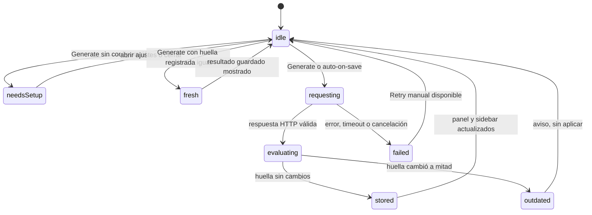

# Etiquetado automático con TypeSafe — Plan de implementación auditado

**Estado:** diseño viable; implementación y pruebas de humo pendientes · **Auditoría:** 2026-09-18 · **Versión:** 0.1

**Objetivo:** generar etiquetas para una nota de forma automática preguntando **varias cuestiones tipadas a TypeSafe (modelo Jev) en una sola llamada**, aplicar umbrales locales con revisión humana y guardar el resultado sin modificar nunca el documento.

**Alcance de esta revisión:** contraste con el árbol de trabajo actual de Glassmark y la documentación oficial de TypeSafe consultada el 2026-09-18. No se ha llamado a la API con credenciales reales, no se ha probado el Keychain ni ejecutado el flujo de UI. Las comprobaciones de Fase 0 son condiciones de implementación, no resultados ya obtenidos. Este documento no implementa la función.

**Verificación del documento:** los ejemplos JSON se parsearon con `python3 -m json.tool`; los bloques Bash se comprobaron con `bash -n`; los contratos Swift mostrados (DTO de petición/respuesta, codificación de preguntas, taxonomía de errores) se comprobaron con `swiftc -swift-version 6 -typecheck` (Xcode 26, con tipos auxiliares todavía fuera de la app). Estos chequeos no sustituyen las pruebas funcionales de §9.

## 1. Dictamen y decisiones para el MVP

El enfoque elegido encaja con la arquitectura que TypeSafe documenta para software asistido por IA: el código controla el flujo y el modelo solo resuelve juicios acotados. Aquí el juicio es «¿esta nota trata sustantivamente de esta etiqueta?», descompuesto en N preguntas atómicas que se evalúan en paralelo en una única petición.

Dos consecuencias definen todo el diseño. La primera: **Jev no genera texto**; solo devuelve distribuciones sobre opciones suministradas, así que las etiquetas posibles las define el usuario en un vocabulario por workspace y el modelo nunca podrá asignar una etiqueta que no esté en la lista (la cobertura de candidatos pasa a ser responsabilidad del producto). La segunda: una probabilidad no es una decisión; los umbrales son política de la aplicación y deben validarse con datos propios.

Un enfoque ingenuo («etiquetar automáticamente las notas» a secas) no sería implementable con garantías sin resolver estos puntos:

| Prioridad | Hallazgo | Corrección en este plan |
| --- | --- | --- |
| P0 | Jev no genera texto: no puede inventar nombres de etiqueta. Un ítem ausente del vocabulario nunca podrá asignarse. | Vocabulario por workspace gestionado por el usuario (con descripción y ejemplos que alimentan los criterios); la UI explica que «generar» = puntuar y asignar del vocabulario, no proponer etiquetas nuevas. §4.1 |
| P0 | La precisión en idiomas distintos del inglés no está garantizada (inglés es el idioma primario de Jev). | Instrucciones y criterios en inglés; notas en cualquier idioma; medir precisión real en Fase 0 con notas del usuario antes de prometer nada; umbrales conservadores y banda de revisión. §4.3, §10 |
| P0 | Un resultado sin ligadura al contenido puede acabar describiendo una nota ya editada. | Cada job captura huella SHA-256 del texto, versión del catálogo, modelo y versión de plantilla; si algo cambia a mitad, el resultado se descarta (nunca se aplica a contenido distinto). §4.4, §6 |
| P0 | Mezclar semánticas de Choice y Noul: no son intercambiables (el propio modelo documenta que no se garantizan invariantes estructurales, ni siquiera `P(x) + P(no x) = 1`). | La pertenencia la decide **solo** el Noul por etiqueta; el Choice (etiqueta principal) solo ordena y destaca. No se derivan unos de otros ni se mezclan umbrales. §4.3 |
| P0 | `README.md` y `PRIVACY.md` afirman hoy que la única salida de red es la edición IA; un segundo envío óptico crearía una contradicción. | Reescribir ambas frases en la misma entrega que habilite la función, con el texto propuesto de §7.4. |
| P0 | Sin caps ni cola, el etiquetado automático y el lote pueden disparar peticiones sin control (coste y atención). | Una petición en vuelo por vez, gates de configuración/clave, dedupe por huella, debounce, cancelación y sin truncado silencioso de notas grandes. §6.4, §10 |
| P0 | Nota larga: el estado grande con ruido reduce la precisión de Jev y consume presupuesto compartido (estado + preguntas). | Límite local de nota (48 000 unidades UTF-16, provisional), rechazo con mensaje claro si se excede, sin truncar; calibrar en Fase 0 con `usage.input_tokens` reales. §4.4 |
| P1 | La identidad de archivo actual es la URL; renombrar/mover no conserva identidad y las etiquetas se guardan por ruta relativa. | Etiquetas con id UUID de catálogo y registros por `relativePath`; `WorkspaceStore` publica mutaciones (mover/borrar) y `LabelStore` migra o poda. §5.4 |
| P1 | Segundo secreto en Keychain: los builds Debug ad-hoc ya requieren el fallback DP→legacy de `GeminiCredentialStore`. | Nuevo `TypesafeCredentialStore` con el mismo patrón y su propia clave de backend; extraer el helper de fallback compartido para evitar divergencias. §7.1 |
| P1 | El alias `jev-latest` puede moverse a una versión distinta sin cambiar nada en la app. | Pin por defecto `jev-1.13.0`; alias opcional etiquetado como «tracks updates»; la respuesta devuelve el ID versionado y se guarda con el resultado. §3.2 |
| P1 | Render del sidebar: mostrar etiquetas por fila no debe añadir E/S ni cálculo pesado. | `LabelStore` expone diccionarios en memoria por workspace; las filas solo leen; poda diferida. §2, §6.3 |
| P1 | Regla del repositorio: **cero dependencias SPM** y Swift 6 estricto. | Cliente propio con `URLSession` + `Codable` (mismo patrón que `GeminiClient`), tipos `Sendable`, store `@MainActor`. §5, §6 |

### Decisiones para el MVP

| Área | Decisión |
| --- | --- |
| API / transporte | `POST https://api.typesafe.ai/v1/systemone` con `Authorization: Bearer`, JSON sobre `URLSession` efímera, sin SDK ni dependencias. |
| Modelo | `jev-1.13.0` (pin). Preset alternativo `jev-latest` (alias móvil), etiquetado en Ajustes. |
| Credenciales | Clave propia (BYOK) en Keychain, cuenta `typesafe-api-key`, servicio `com.recurse.glassmark`. |
| Preguntas | **Múltiples preguntas en una llamada**: 1 `Choice` (etiqueta principal, con opción `none`) + 1 `Noul` por etiqueta, con criterios estructurados. |
| Vocabulario | Etiquetas por workspace (id UUID, nombre único, descripción y ejemplos opcionales). Máximo 40. |
| Resultado | Umbrales provisionales: aplicada ≥ 0,80 · sugerida [0,50–0,80) · descartada < 0,50. Validar en Fase 0. |
| Almacenamiento | Archivo lateral de la app (`labels.json` en Application Support); el documento nunca se toca. |
| Disparo | Manual («Labels…», `⌃⌘L`) por defecto; «Label notes after saving» opt-in. Sin lote masivo en MVP. |
| UI | Ajustes → pestaña **Labels**; panel modal por ventana; chips de etiquetas en las filas del sidebar. |
| Privacidad | Envía solo el texto de la nota y los nombres/descripciones de las etiquetas, con la clave del usuario; sin telemetría, sin logs de contenido. |
| Documentación | Actualizar README y PRIVACY en la misma entrega que habilite la función. |
| Idioma UI | Inglés, coherente con la app. El contenido de las notas conserva su idioma. |
| Fuera de MVP | Lote de workspace, filtro por etiqueta, escritura/lectura de frontmatter, umbrales configurables, página de revisión de umbrales. Fase 2. |

## 2. Experiencia de usuario

1. Con una nota abierta, `⌃⌘L` abre el panel **Labels** de esa nota (sheet modal; captura la nota activa al abrirse, de modo que el cambio de documento queda bloqueado mientras el panel está visible).
2. Si la función no está habilitada o falta la clave, el panel muestra un estado de configuración con **Open Labels Settings**; abrir Ajustes nunca envía nada, y al volver se vuelve a capturar la nota.
3. Con el vocabulario vacío, el panel pide añadir etiquetas en Ajustes (sin vocabulario no hay preguntas posibles: el modelo no puede inventar etiquetas).
4. **Generate** lanza una petición única con `1 + N` preguntas. El progreso es un spinner breve (la documentación describe latencias típicas de ~100 ms y los cookbooks de TypeSafe miden 111–114 ms para rúbricas de 8–14 preguntas). **Cancel** está siempre disponible.
5. Al llegar la respuesta, el panel muestra: etiquetas **aplicadas** (probabilidad visible en tooltip/accesibilidad), **sugerencias** con su probabilidad y botones **Accept**/**Discard** por fila, y el contador `Applied N · Suggested M · Updated <fecha>`.
6. Reglas de negocio visibles en microcopy: «Labels come from the list you maintain in Settings. Notes are never edited.»
7. El auto-etiquetado («Label notes after saving») actúa en silencio tras un guardado correcto, con 5 s de calma y solo si la huella cambió; el panel de la nota afectada refleja el resultado si está abierto.
8. Las filas del sidebar muestran hasta 2 etiquetas aplicadas (+`+N`), con tooltip de la lista completa. Las sugerencias no se muestran en el sidebar hasta aceptarse.
9. Errores: mensajes por categoría (sin cuerpos crudos), **Retry** explícito solo si el destino sigue vigente; 429/529 respetan `retry-after` con un máximo de 2 reintentos automáticos (la propia documentación recomienda backoff en esos dos códigos, a diferencia de 401/422, que nunca se reintentan).

| Caso | Comportamiento |
| --- | --- |
| Nota vacía o solo espacios | Sin petición; mensaje local «Nothing to label.» |
| Nota mayor que el límite (48 000 UTF-16 provisional) | Rechazo antes de enviar con mensaje y tamaño; nunca truncar. |
| Edición del texto a mitad de petición (otra ventana o editor externo) | El resultado se descarta al detectar huella distinta; el panel queda como «Outdated — regenerate.» |
| Cambio de workspace, deshabilitar la función o eliminar la clave | Cancela jobs en vuelo y cierra el panel; las etiquetas ya guardadas no se tocan. |
| Renombrar o mover un archivo o carpeta | `WorkspaceStore` publica la mutación; `LabelStore` migra los registros por prefijo. |
| Enviar a la papelera | Se eliminan los registros de esa ruta (y descendientes). |
| Duplicar o copiar archivo | El duplicado nace sin etiquetas; ninguna herencia. |
| Cerrar y reabrir la misma URL | Las etiquetas persisten (clave = ruta relativa); la huella decide si están al día. |
| Dos ventanas | El `LabelStore` es compartido (las etiquetas son del workspace); cada ventana presenta su propio panel. |
| Modo preview-only | El panel de etiquetas sigue disponible (no necesita editor); el comando se habilita con documento abierto. |
| Sin red / timeout | Error de transporte; sin reintento automático (solo 429/529 se reintentan). |
| IME y teclados | El panel no captura teclas globales más allá de sus botones; `Esc` cierra el panel. |

Accesibilidad: los chips y filas del panel incluyen `accessibilityLabel` con nombre, estado y probabilidad («Label cooking, suggested, 62 percent»); nunca se comunica solo por color.

## 3. Contrato TypeSafe comprobado

### 3.1 API y petición

TypeSafe expone un único endpoint de evaluación, documentado como `POST https://api.typesafe.ai/v1/systemone` con `Authorization: Bearer <API_KEY>` y `Content-Type: application/json` ([API reference](https://docs.typesafe.ai/api.md), [Quick start](https://docs.typesafe.ai/introduction/quickstart.md)). El cuerpo tiene tres campos: `state` (string u objeto/array de texto; aquí un objeto `{"note": …}`), `model` y `questions` (mapa id → pregunta). Los **ids de pregunta son locales**: se eligen en el cliente, no se envían al modelo y cada respuesta vuelve bajo el mismo id; por eso las instrucciones deben contener la pregunta completa ([Primitives](https://docs.typesafe.ai/primitives.md)).

Petición de ejemplo para una nota (JSON verificado; también sirve como fixture de test):

```json
{
  "model": "jev-1.13.0",
  "state": { "note": "Apuntes del viaje a Lisboa: ruta por Alfama, miradouros y una lista de pastelerías para probar el pastel de nata." },
  "questions": {
    "primary": {
      "type": "choice",
      "instructions": "Which label, if any, is the primary topic of `note`?",
      "criteria": {
        "cooking": "Recipes, ingredients, or kitchen technique.",
        "travel": "Trips, places, or itineraries.",
        "work": "Professional projects, meetings, or career notes.",
        "none": "No label primarily matches the note."
      }
    },
    "match_cooking": {
      "type": "noul",
      "instructions": "Is `note` substantively about cooking or recipes?",
      "criteria": {
        "true": {
          "what": "Describes preparing, choosing, or planning food.",
          "examples": ["A recipe for tortilla de patatas"]
        },
        "false": {
          "what": "Mentions food only in passing, or not at all.",
          "examples": ["A travel itinerary that lists a pastry shop"]
        }
      }
    },
    "match_travel": {
      "type": "noul",
      "instructions": "Is `note` substantively about travel, places, or itineraries?"
    },
    "match_work": {
      "type": "noul",
      "instructions": "Is `note` substantively about professional projects, meetings, or career notes?"
    }
  }
}
```

Tipos y límites documentados de pregunta:

| Tipo | Campos | Límites documentados |
| --- | --- | --- |
| `choice` | `instructions`, `criteria` (mapa opción → descripción o `null`) | Hasta 255 opciones; los propios cookbooks hablan de fiabilidad práctica «hasta ~240» ([Choice](https://docs.typesafe.ai/primitives/choice.md), [Classification using confidence](https://docs.typesafe.ai/cookbooks/classification_using_confidence.md)). |
| `noul` | `instructions`; `criteria` opcional `{true, false}` con `string`, objeto o array | Ideal para juicios sí/no donde la propia probabilidad es la señal. La banda estructurada `what`/`examples` fija la frontera ([Noul](https://docs.typesafe.ai/primitives/noul.md), [Advanced](https://docs.typesafe.ai/primitives/advanced.md)). |
| `score` | `instructions`, `criteria` array ordenado | 2–10 niveles. No se usa en el MVP ([Score](https://docs.typesafe.ai/primitives/score.md)). |

Las instrucciones y criterios referencian campos del `state` con rutas entre backticks (por eso `state` es un objeto `{"note": ...}` y no un string plano; la documentación recomienda objetos en cuanto cada parte necesita nombre, [State](https://docs.typesafe.ai/concepts/state.md)).

Respuesta de ejemplo (esquema verificado; los valores son ilustrativos):

```json
{
  "model": "jev-1.13.0",
  "answers": {
    "primary": {
      "type": "choice",
      "choice": "travel",
      "probabilities": { "cooking": 0.01, "travel": 0.95, "work": 0.02, "none": 0.02 },
      "confidence": 0.86
    },
    "match_cooking": { "type": "noul", "noul": 0.03 },
    "match_travel": { "type": "noul", "noul": 0.96 },
    "match_work": { "type": "noul", "noul": 0.11 }
  },
  "usage": { "input_tokens": 486, "output_tokens": 31 }
}
```

- `choice` viene con `probabilities` (suma 1) y `confidence` (concentración de la distribución); `noul` es solo P(sí), sin `confidence` separada.
- La respuesta incluye `usage` con `input_tokens`/`output_tokens`; se registra por job (en memoria) para que el usuario vea el gasto y para calibrar umbrales de tamaño.
- Errores documentados: `401` (clave), `422` (validación, el cuerpo detalla el campo culpable), `429` (límite; la documentación recomienda backoff exponencial) y `529` (sobrecarga temporal). [API reference](https://docs.typesafe.ai/api.md)
- `GET /v1/models` lista los nombres aceptados por `model` (hoy los alias; los IDs versionados se aceptan aunque no aparezcan). Sirve como comprobación de credencial sin consumir evaluación ([Models](https://docs.typesafe.ai/models.md)).

### 3.2 Modelo, alias y coste

- Modelo actual: **Jev 1.13** (`jev-1.13.0`); alias `jev-latest` y `jev-preview` apuntan hoy a esa misma versión ([Models](https://docs.typesafe.ai/models.md)).
- Precio publicado: **$42 por Btok = $0,042 por Mtok de entrada; los tokens de salida son gratis**; se cobra por token de entrada. Límites: 250 000 tok/s y 1 200 req/min, *en ajuste dinámico y sujetos a cambio sin aviso* (la propia página advierte). Para este caso de uso el límite es irrelevante; la cola serial mantiene el ritmo muy por debajo.
- Un alias puede moverse a una versión nueva: por eso el MVP usa `jev-1.13.0` pin, guarda el `model` devuelto con cada resultado y ofrece el alias solo como opción etiquetada «tracks updates» (ajustar umbrales contra una versión concreta es la recomendación oficial).
- **Idioma:** inglés es el idioma primario de entrenamiento; otros idiomas «se aceptan pero con menor precisión; hay que probar con contenido propio antes de depender de Jev para un flujo no inglés, y vigilar `confidence`» ([Models](https://docs.typesafe.ai/models.md#language-support)). Es el mayor riesgo de producto de este plan: el usuario trabaja principalmente en español.

### 3.3 Múltiples preguntas: el núcleo de la función

TypeSafe está diseñado explícitamente para acumular preguntas independientes en una sola llamada: se evalúan en paralelo, una no es contexto oculto de otra, y añadir preguntas apenas cambia la latencia (solo cuesta tokens; cada pregunta extra es barata). El patrón se llama *speculative fan-out* y permite preguntar de más y decidir en código qué respuestas importan ([How to build](https://docs.typesafe.ai/concepts/how-to-build-with-system-one.md), [Fan-out](https://docs.typesafe.ai/patterns/fan-out.md), [Primitives](https://docs.typesafe.ai/primitives.md#ask-multiple-questions-together)).

Evidencia de los cookbooks de TypeSafe:

| Experimento | Resultado documentado |
| --- | --- |
| [Parallel questions](https://docs.typesafe.ai/cookbooks/parallel_questions.md) (13 preguntas sobre un artículo de ~54 000 caracteres) | Una llamada con las 13 preguntas = **12,2× más barata y 10,0× más rápida** que 13 llamadas; respuestas idénticas (sin cambio de sesgo ni de varianza). El resumen del `llms.txt` repite 12,2×/10,0×; la página `primitives.md` cita 11,5×/9,6× de la misma familia de datos (ver discrepancias, §3.5). |
| [Self-consistency: nouls](https://docs.typesafe.ai/cookbooks/consistency_noul_cookbook.md) | 14 Nouls en una llamada; latencia media 111 ms; coste medio $0,000043 por llamada; desviación estándar media de probabilidad 0,0102. |
| [Self-consistency: choices](https://docs.typesafe.ai/cookbooks/consistency_choice_cookbook.md) | 8 Choices en una llamada; latencia media 114 ms; coste medio $0,000046; con banda de incertidumbre (<0,60 ⇒ revisar) la concordancia sube de 90,8 % a 99,2 %, con 25,8 % de respuestas en «incierto». |
| [Skill suggestion](https://docs.typesafe.ai/cookbooks/skill_suggestion.md) | 182 opciones en un único `Choice` + Nouls de comprobación; dos umbrales ilustrativos (0,30/0,30) y lección clave: *el Choice decide **cuál**, los Nouls deciden **si** procede algo*. Se usa la misma separación aquí. |

Presupuesto: el contexto por petición es de 64k tokens, con 32k para `state` + la pregunta más larga (y ese mismo presupuesto lo comparten estado y todas las preguntas). La estimación informal «~32 000 tokens ≈ 150 000 caracteres de inglés» aparece en [Primitives](https://docs.typesafe.ai/primitives.md), pero los caracteres no son una cuota: dependen del idioma. La app usa tokens reales de `usage` para calibrar.

### 3.4 Fiabilidad y límites del modelo (aplican al diseño)

La página [Jev 1.13 jaggedness](https://docs.typesafe.ai/model-jaggedness/jev-1.13.md) (revisada 2026-09-17) documenta modos de fallo relevantes:

- **Lectura literal:** responde a la pregunta escrita, no a la intención; los casos límite deben estar en los criterios.
- **Sin aritmética ni conteo:** nada de contar ocurrencias ni calcular; todo eso vive en código.
- **Estado grande con detalle irrelevante:** la precisión baja con contexto ruidoso; filtrar en código y enviar solo lo necesario. Mitigación aquí: límite de tamaño + una única nota como estado + vocabulario acotado; para notas enormes el resultado se debe tratar con más desconfianza.
- **Contenido adversario:** el estado es dato, no instrucciones, pero texto escrito para influir puede mover la respuesta; criterios precisos y pruebas con casos reales.
- **Invariantes estructurales no garantizadas:** `P(x)` como Noul y el `yes` de un Choice que pregunta lo mismo no son comparables, y `P(x) + P(no x)` puede no sumar 1. De aquí la regla P0 de no mezclar tipos para el mismo juicio.
- **No genera texto:** para valores libres, extraer candidatos en código (regex, cabeceras) y dejar que Jev seleccione entre opciones; nunca pedirle que «escriba» etiquetas.

Los cookbooks de autoconsistencia muestran además que una probabilidad cerca de un umbral puede oscilar entre ejecuciones (p. ej., un Noul entre 0,43 y 0,53). La respuesta correcta no es buscar determinismo: es la banda de revisión de §4.3, recordando que «probar umbrales con ejemplos etiquetados y el coste de equivocarse» es la recomendación oficial ([Confidence](https://docs.typesafe.ai/confidence.md)) y que las bandas de los cookbooks (0,30/0,70 y 0,60) son ilustrativas, no calibradas.

### 3.5 Discrepancias documentales detectadas

Registradas para no convertirlas en promesas de producto:

| Tema | Fuente A | Fuente B | Tratamiento |
| --- | --- | --- | --- |
| Factor de ahorro al agrupar preguntas | `primitives.md`: «11,5× más barato y 9,6× más rápido» | Cookbook y `llms.txt`: «12,2× más barato y 10,0× más rápido» | Ambas son mediciones de la misma familia; el plan cita «≈10× más barato/rápido» como orden de magnitud, sin cifra exacta. |
| Presupuesto de tokens | `models.md`/API: 64k por petición; 32k para estado + pregunta más larga | `primitives.md`: «~32 000 tokens, ~150 000 caracteres de inglés» | Se adopta la formulación de `models.md`; los caracteres no se usan como límite (varía por idioma). |
| Opciones máximas de Choice | `choice.md`: «hasta 255» | Cookbook: «fiable hasta ~240» | 255 = tope; ~240 = fiabilidad práctica. El cap del MVP (40) queda muy por debajo por coste, no por límite técnico. |
| Límites de rate | `models.md`: 250k tok/s, 1 200 req/min | La misma página: «los límites se ajustan dinámicamente» | No hardcodear; manejar 429/529. |
| Estado del alias preview | — | `models.md`: `jev-preview` apunta hoy a `jev-1.13.0` | No ofrecer `jev-preview` en el MVP. |
| Precios | `models.md`: tabla publicada de Jev 1.13 | Cookbooks: «historical price assumptions… not verified current billing» | El coste del MVP es estimación; verificar precio y facturación en Fase 0. |
| Latencia «~100 ms» | `how-to-build`: «most queries complete in about 100 ms» | Cookbooks: 111–114 ms de media | Expectativa: ~100–300 ms por nota; medir en Fase 0. |
| Errores del endpoint | Tabla de `/api`: 401/422/429/529 | SDKs: clases para 400/403/404/500+ en la superficie general | Para `/v1/systemone` se mapean los cuatro documentados con precisión y cualquier otro 4xx/5xx como error genérico saneado. |

### 3.6 Privacidad del proveedor (afirmaciones a citar con cuidado)

`models.md` afirma que **Jev no se entrena con las peticiones ni respuestas de los clientes**, y remite a los documentos legales: DPA, MCA y Política de Privacidad, con retención cero (ZDR) solo para planes enterprise ([Legal](https://docs.typesafe.ai/legal.md)). Es una política del proveedor, no una garantía técnica de la app: la UI y la documentación deben enlazarla y no extrapolar condiciones de un plan a otro. A diferencia de Gemini, no se documenta aquí una diferencia «free vs paid» sobre entrenamiento; lo que sí hay es retención limitada estándar y ZDR de pago.

## 4. Diseño del etiquetado

### 4.1 Vocabulario (el contrato con el usuario)

```swift
struct LabelDefinition: Codable, Identifiable, Equatable, Sendable {
    let id: UUID
    var name: String            // clave visible; única por workspace (case-insensitive)
    var description: String?    // «what this label covers», alimenta criteria
    var examples: [String]      // 0–3 ejemplos, alimentan criteria
}
```

Reglas de validación (en el store, con tests):

- `name` no vacío tras `trim`, ≤ 40 unidades UTF-16, único por workspace case-insensitive; **se rechaza el nombre reservado `none`** (colisiona con el centinela del Choice).
- `description` ≤ 160 UTF-16; `examples` ≤ 3 × 80 UTF-16.
- Máximo 40 etiquetas por workspace (MVP; Choice admite hasta 255 y la fiabilidad práctica ~240, pero cada etiqueta añade tokens de pregunta y el límite aquí es de producto/coste).
- Renombrar conserva el `id` y **no** toca los registros de archivo (referencian `labelID`); eliminar una etiqueta elimina sus asignaciones de todos los registros del workspace.
- El vocabulario es por workspace y se persiste en el sidecar (§6.3). Las etiquetas manuales del usuario conviven con las generadas.

Por qué vocabulario y no «etiquetas libres»: Jev devuelve siempre una distribución sobre las opciones suministradas, nunca un valor fuera del esquema; la cobertura de candidatos es lo único que limita el resultado ([Primitives](https://docs.typesafe.ai/primitives.md), [Jaggedness](https://docs.typesafe.ai/model-jaggedness/jev-1.13.md#generation)).

### 4.2 Banco de preguntas (múltiples preguntas por nota)

Una petición por nota, construida por `LabelQuestionBuilder` (función pura, testeable):

| id local | tipo | instrucción | criterios |
| --- | --- | --- | --- |
| `primary` | Choice | ``Which label, if any, is the primary topic of `note`?`` | una opción por etiqueta (nombre → descripción o `null`) + opción `none` |
| `match_<uuid>` | Noul | ``Is `note` substantively about "<name>"?`` | `true` → `{what: <descripción o regla por defecto>, examples: <ejemplos o []>}`; `false` → `{what: "Mentions it only in passing, or not at all.", examples: [...]}` |

Reglas del builder:

- `primary` se omite con una sola etiqueta (un Choice de una opción no aporta nada); con vocabulario vacío no hay petición.
- Con N etiquetas se envían `1 + N` preguntas, todas independientes, en una sola llamada (speculative fan-out; el coste marginal por pregunta es de unos pocos tokens).
- Los ids de pregunta usan el UUID del catálogo (opacos para el modelo, estables para el mapeo de respuestas); el nombre y la definición visibles viajan en `instructions`/`criteria`.
- Texto del usuario **no** se interpola en instrucciones (solo el texto de la nota como `state`, del que nunca se envían ruta ni nombre de archivo).
- Plantilla versionada: `LabelingQuestionTemplate.version` (entero) forma parte de la huella de frescura; cambiar la redacción invalida resultados anteriores.
- Idioma: instrucciones y criterios en inglés; el contenido de la nota se envía tal cual y los textos de etiqueta se usan literalmente.

Ajuste fino preferido en Fase 0 (documentado, no implementado aún): comparar la formulación del Noul con y sin `criteria` y con frases del tipo «Is the note’s main subject…»; medir en notas reales en español. La documentación de Noul recomienda probar ambas formulaciones con datos propios.

### 4.3 Política de resultado (código, no modelo)

Dado el conjunto de respuestas válidas, `LabelPolicy` decide sin volver a llamar al modelo:

- `noul ≥ 0,80` → **aplicada** (`source: auto`).
- `0,50 ≤ noul < 0,80` → **sugerida** (requiere Accept del usuario).
- `noul < 0,50` → descartada.
- El `Choice` decide solo la **etiqueta principal** (orden/destacado): si su opción elegida es una etiqueta ya aplicada, se marca como principal; si elige `none`, no se destaca ninguna. **Nunca** condiciona la pertenencia ni se convierte en umbral.
- Regenerar sustituye las entradas `auto` y `suggested` del registro por las nuevas; las `accepted` (validadas por el usuario) y `manual` se conservan hasta que el usuario las elimine.
- Los valores 0,80/0,50 son **provisionales**; se calibran en Fase 0 con notas etiquetadas a mano, midiendo precisión y recall por etiqueta y el coste de un falso positivo (una etiqueta mal puesta es molesta; una sugerencia mal puesta solo es ruido). Los cookbooks documentan bandas ilustrativas (0,30–0,70 para Noul; 0,60 para Choice) y advierten de que los umbrales de producción se eligen con ejemplos etiquetados ([Confidence](https://docs.typesafe.ai/confidence.md), [Self-consistency: nouls](https://docs.typesafe.ai/cookbooks/consistency_noul_cookbook.md)).
- Cerca del umbral el modelo no es determinista; la banda de revisión absorbe parte de la oscilación, no la elimina. La UI mantiene visible la probabilidad para que la revisión sea informada.

### 4.4 Huella, frescura y límites

`LabelingFingerprint` = `{ contentHash: SHA-256(nota en UTF-8), catalogHash: SHA-256(etiquetas ordenadas: id, nombre, descripción, ejemplos), model: String, templateVersion: Int }`.

- Un registro se considera **fresco** si los cuatro componentes coinciden; entonces `Generate` muestra el resultado guardado sin llamar a la red (el botón pasa a **Regenerate** para forzar).
- El texto de la nota se captura antes de enviar; al completar se recalcula la huella del contenido actual y, si difiere, el resultado se descarta (`outdated`). Nunca se aplica un resultado a contenido que no es el evaluado.
- Límite de nota: `maxNoteUTF16 = 48 000` provisional, calibrado en Fase 0 contra el presupuesto de 32k tokens (estado + pregunta más larga) y contra el modo de fallo «estado grande = menos precisión». Si se supera: rechazo local con mensaje, sin truncar, sin enviar.
- El frontmatter YAML, si existe, viaja como parte del texto (es contenido del documento); las etiquetas del frontmatter no se leen ni se escriben en el MVP (Fase 2 podría ofrecer importación/exportación explícita).

### 4.5 Coste estimado (a verificar en Fase 0)

Nota media de 3 000 caracteres (≈ 700–900 tokens de entrada en inglés; más en español) + Choice (~10 opciones) + 10 Nouls con criterios (~150–300 tokens) + plantilla (~50–100) ≈ **1,0–1,4k tokens de entrada** por nota.

$$\text{coste} = \text{tokens} \times \frac{\$0{,}042}{10^6} \approx \$0{,}00005\ \text{por nota} \quad\Rightarrow\quad 1\,000\ \text{notas} \approx \$0{,}05$$

Los tokens de salida son gratis; una cola serial a ~1 req/s queda a años luz del límite de 1 200 req/min. La cifra debe confirmarse con el `usage` real en Fase 0 (y con la advertencia de que precios/límites pueden cambiar).

## 5. Integración con el repositorio actual

### 5.1 Hallazgos del código y sus implicaciones

| Código actual | Implicación |
| --- | --- |
| `GlassMarkApp` crea `WorkspaceStore`, `DocumentStore`, `PreferencesStore`, `CommandStore` y `GeminiCredentialStore` a nivel App; `WindowGroup` + `Settings`. | Las etiquetas son estado de workspace compartido: el nuevo `LabelStore` también vive aquí (a diferencia de `InlineEditStore`, que es por ventana por depender de la selección de cada editor). Ajustes recibe los dos credential stores. |
| `DocumentStore.write(_:)` es el único punto de escritura correcta (`save()` y autosave pasan por él; debounce 1,2 s; `saveMessage` se fija tras éxito). | Punto de enganche del auto-etiquetado: publicar un `lastSaveEvent` solo tras escritura correcta (§5.3). |
| `DocumentStore.updateText` incrementa `revision` solo con cambios UTF-16 reales; `EditorDocument` ya tiene `sessionID` y `revision`. | Identidad de documento disponible para correlacionar el panel; no se necesita tocar el modelo. |
| `WorkspaceStore` centraliza `create/rename/move/duplicate/copy/moveToTrash` con `refreshFileTree()` posterior; **no hay file watching**; `rename` no notifica a `DocumentStore` (solo `move` lo hace, vía `SidebarView`). | Las etiquetas por ruta necesitan migración explícita: publicar mutaciones en `WorkspaceStore` y consumirlas en `LabelStore`. El arreglo de `DocumentStore` en `rename` es un bug colateral conocido, fuera del alcance salvo que se decida incluirlo. |
| `ContentView` enruta cambios entre stores con `.onChange` (revision→inlineEdit, credenciales→inlineEdit, etc.) y publica acciones con `.focusedSceneValue`. | Mismo patrón para el auto-etiquetado (save event), mutaciones de archivos, cambios de credenciales/preferencias y comando `⌃⌘L`. |
| `FileTreeView`/`FileRow` renderizan el sidebar con `List` y etiquetas `Label`. | Chips de etiquetas en la línea secundaria de `FileRow`, leyendo de un diccionario en memoria (sin E/S por fila). |
| `PreferencesStore` usa `@AppStorage`; `SettingsTab {general, editor, preview, ai}`. | Nuevas claves y nueva pestaña `labels`; patrón conocido. |
| `GeminiCredentialStore` documenta el fallback DP→legacy por builds ad-hoc sin Team ID, con `geminiKeychainBackend` en `UserDefaults`. | Reutilizar el patrón (y extraer el helper común) para `typesafe-api-key` + `typesafeKeychainBackend`. |
| `GeminiClient` (URLSession efímera, protocolo `Sendable`, errores tipados, límites locales, sin SPM) y `TestSupport`/`StubURLProtocol`. | El cliente TypeSafe replica el patrón; los dobles de red ya tienen precedente directo en `GeminiClientTests`. |
| `project.yml`: sin paquetes, macOS 15, Swift 6, sandbox con `network.client`. | Nada nuevo de dependencias/entitlements; regenerar con `xcodegen generate` tras añadir archivos. |
| README/PRIVACY afirman que la única salida es la edición IA. | Reescribir ambas en la entrega del MVP (§7.4). |

### 5.2 Propiedad del estado

- `LabelStore` (nivel App, `@MainActor ObservableObject`): catálogo por workspace, registros por archivo, estado de jobs (una petición en vuelo, cola), errores publicados, diccionarios en memoria para el sidebar.
- Estado de presentación por ventana: `@State isLabelsPanelPresented` y la nota capturada al abrir el panel; `LabelsAction` se publica con `.focusedSceneValue(\.labels, …)` para que `⌃⌘L` solo afecte a la ventana activa.
- El panel es modal: mientras está abierto no se puede cambiar de documento en esa ventana; aun así, el fingerprint cubre cambios externos y de otras ventanas.

### 5.3 Puntos de enganche (cambios mínimos y testables)

1. `DocumentStore`: `struct DocumentSaveEvent: Equatable { documentID, workspaceID, sessionID, revision }` y `@Published private(set) var lastSaveEvent: DocumentSaveEvent?`, fijado en `write(_:)` **solo tras éxito**.
2. `WorkspaceStore`: `enum WorkspaceFileMutation: Equatable { case moved(fromRelativePath: String, toRelativePath: String, isDirectory: Bool); case trashed(relativePath: String, isDirectory: Bool) }` y `struct FileMutationEvent: Identifiable, Equatable { let id = UUID(); let workspaceID: Workspace.ID; let mutation: WorkspaceFileMutation }` publicado como `@Published private(set) var lastFileMutation: FileMutationEvent?`, emitido en `rename`, `move` y `moveToTrash` tras el éxito.
3. `ContentView`: `.onChange` de `lastSaveEvent` → `labelStore.documentSaved(...)`; de `lastFileMutation` → `labelStore.handle(mutation, workspaceID:)`; de `preferencesStore.labelingEnabled/labelingOnSave` y del estado de credenciales → `labelStore.configurationChanged()`.
4. `AppCommands`: grupo tras `.pasteboard` con **Labels…** `⌃⌘L`, habilitado con `labelsAction != nil && documentStore.document != nil`.

### 5.4 Sidecar, identidad y migración

- Persistencia: `Application Support/GlassMark/labels.json` dentro del contenedor sandbox (ruta resuelta con `FileManager.url(for: .applicationSupportDirectory, …)`), un solo archivo con `schemaVersion`.
- Clave de archivo: `relativePath` dentro del workspace (`WorkspaceFile.relativePath` ya existe). El id de workspace es `Workspace.ID` (UUID).
- Migraciones: `moved` reasigna la ruta (y los descendientes por prefijo si `isDirectory`); `trashed` elimina esos registros; `copied/duplicated` no heredan nada (no hay evento). Renombrar el workspace no cambia ids; cambiar de carpeta raíz no está soportado y el registro queda huérfano hasta poda.
- Poda: con la función habilitada, tras `refreshFileTree()` se eliminan registros cuya ruta ya no existe (operación diferida y fuera del render; no bloquea el sidebar).
- Reapertura de la misma URL: la ruta relativa es estable, así que las etiquetas persisten; la huella decide si el resultado está al día.

### 5.5 Invariantes del MVP

- Ninguna operación de etiquetado modifica el documento: sin escrituras, sin entradas de undo, sin tocar `isDirty`, autosave, preview ni búsqueda.
- Nunca se envía ruta, nombre de archivo, ruta de workspace, otras notas ni texto adyacente; solo `{"note": <texto>}` + etiquetas + plantilla.
- Ninguna petición se dispara sin: función habilitada + clave presente + acción del usuario (manual) o toggle «after saving» activo. Guardar la clave nunca genera tráfico (el test de conexión es explícito).

## 6. Estado, concurrencia y almacenamiento

### 6.1 Máquina de estados por nota



Cada job lleva `UUID` de generación; los callbacks (resultado, error, timeout) comprueban ese id y los tardíos se ignoran. Cancelar limpia el job y los `Task` asociados; `Task.cancel()` no basta para descartar callbacks ya encolados.

### 6.2 Contratos Swift (verificados con `swiftc -swift-version 6 -typecheck`)

```swift
protocol SystemOneEvaluating: Sendable {
    func evaluate(_ request: SystemOneRequest, apiKey: String) async throws -> SystemOneResponse
}

struct SystemOneRequest: Encodable, Equatable, Sendable {
    struct State: Encodable, Equatable, Sendable { let note: String }
    let model: String
    let state: State
    let questions: [String: SystemOneQuestion]
}

enum SystemOneQuestion: Encodable, Equatable, Sendable {
    case noul(instructions: String, criteria: NoulCriteria?)
    case choice(instructions: String, criteria: [ChoiceOption])

    struct NoulCriteria: Equatable, Sendable { let isTrue: String; let isFalse: String }
    struct ChoiceOption: Equatable, Sendable { let key: String; let description: String? }
    // `encode(to:)` construye las claves heterogéneas ("true"/"false", criterios dinámicos)
    // como en el sketch completo comprobado; los tests fijan el JSON exacto.
}

struct SystemOneResponse: Decodable, Equatable, Sendable {
    struct Usage: Decodable, Equatable, Sendable { let inputTokens: Int; let outputTokens: Int }
    let model: String
    let answers: [String: SystemOneAnswer]
    let usage: Usage
}

enum SystemOneAnswer: Decodable, Equatable, Sendable {
    case noul(probability: Double)                                  // clave "noul"
    case choice(selected: String,                                   // clave "choice"
                probabilities: [String: Double],
                confidence: Double)
}

enum TypesafeAPIError: Error, Equatable, Sendable {
    case authentication
    case invalidRequest(field: String?)
    case rateLimited(retryAfter: TimeInterval?)
    case overloaded(retryAfter: TimeInterval?)
    case server(status: Int)
    case transport(String)
    case timedOut
    case invalidProtocol
    case localLimit
    case cancelled
}

enum LabelingLimits {
    static let maxNoteUTF16 = 48_000            // provisional; calibrar en Fase 0
    static let maxLabelsPerWorkspace = 40
    static let maxLabelNameUTF16 = 40
    static let maxLabelDescriptionUTF16 = 160
    static let maxLabelExamples = 3
    static let maxLabelExampleUTF16 = 80
    static let maxResponseBytes = 1 * 1024 * 1024
    static let maxErrorBodyBytes = 16 * 1024
    static let requestTimeout: TimeInterval = 15
    static let resourceTimeout: TimeInterval = 45
    static let maxRetries = 2
    static let retryBaseDelay: TimeInterval = 1.0
    static let maxRetryDelay: TimeInterval = 30
    static let acceptThreshold = 0.80           // provisional
    static let reviewThreshold = 0.50           // provisional
    static let templateVersion = 1
}
```

Validación de la respuesta (en el cliente, con tests): todos los ids solicitados presentes; el tipo coincide; `choice` ∈ opciones; `noul` ∈ [0,1]; probabilidades suman ≈1 (tolerancia 0,02); respuestas extra desconocidas se ignoran (evolución del proveedor permitida) pero **falta o tipo incorrecto ⇒ `invalidProtocol`**. El decoder usa `CodingKeys` para `input_tokens`/`output_tokens`; no se decodifica `legend` (no se usa Score).

### 6.3 Persistencia

```json
{
  "schemaVersion": 1,
  "workspaces": {
    "<workspace-uuid>": {
      "catalog": [
        { "id": "<uuid>", "name": "cooking", "description": "Recipes and kitchen technique.", "examples": ["pastel de nata"] }
      ],
      "files": {
        "notes/lisboa.md": {
          "labels": [
            { "labelID": "<uuid>", "source": "auto", "probability": 0.96 },
            { "labelID": "<uuid>", "source": "suggested", "probability": 0.62 }
          ],
          "primaryLabelID": "<uuid>",
          "contentHash": "<sha256-hex>",
          "catalogHash": "<sha256-hex>",
          "model": "jev-1.13.0",
          "templateVersion": 1,
          "generatedAt": "2026-09-18T10:42:00Z"
        }
      }
    }
  }
}
```

- `source ∈ {auto, suggested, accepted, manual}`; `probability` es opcional (las manuales no la tienen).
- Escritura atómica (temporal + `replaceItemAt`) y lectura con decode tolerante a campos futuros/ausentes, como `Workspace.init(from:)`.
- Escritura diferida y agrupada (p.ej. tras cada job y al salir); el archivo se carga una vez al arrancar.

### 6.4 Concurrencia, cancelación y reintentos

- Productor fuera de `MainActor` (la lectura del archivo y la petición no bloquean la UI); el store es `@MainActor`. Sin `@unchecked Sendable`.
- Una petición en vuelo global (cola serial de jobs); un job por `(workspaceID, relativePath, contentHash)`; el auto-on-save hace *dedupe* contra el registro y la cola.
- Sesión `URLSession` efímera inyectable (sin cookies ni caché, `reloadIgnoringLocalCacheData`), endpoint HTTPS fijo, **redirects rechazados**, cuerpo de error limitado a 16 KiB y respuesta a 1 MiB, `Content-Type` JSON verificado antes de decodificar.
- Timeouts: 15 s de petición / 45 s de recurso (holgado para latencias de ~100–300 ms y notas grandes); reloj del sistema vía `URLSession`, cancelables.
- Reintentos: **solo** 429 y 529, máximo 2, backoff exponencial con `Retry-After` cuando exista (si no, 1 s y 4 s, con tope de 30 s); 401/422/errores de decodificación nunca se reintentan. Supuesto a confirmar en Fase 0: un 429/529 no llegó a procesarse y por tanto no se factura (no hay documentación explícita; mientras no se confirme, el número de reintentos es bajo y visible en logs de sesión sin contenido).
- Cancelación: `URLSessionTask` asociada al job; al cancelar un panel o desactivar la función se cancela el job, se invalidan sus ids y no se publica nada. Cancelar localmente no garantiza que el proveedor no haya computado ya una petición enviada.
- Sanitización de errores: categoría y estado HTTP, más el nombre del campo cuando 422 lo detalle; nunca el cuerpo completo (puede repetir contenido), nunca cabeceras ni claves; sin `print`/logging de contenido.

## 7. Credenciales, ajustes y privacidad

### 7.1 TypesafeCredentialStore

- Mismos identificadores base que Gemini: `service = "com.recurse.glassmark"`, `account = "typesafe-api-key"`; backend persistido en `UserDefaults` (`typesafeKeychainBackend`) y fallback automático DP→legacy idéntico al de `GeminiCredentialStore` (builds Debug ad-hoc sin Team ID devuelven `errSecMissingEntitlement` al escribir; la lectura da `errSecItemNotFound`). Extraer el helper de fallback a un sitio compartido es un refactor P1 recomendado con tests que preserven el comportamiento actual.
- API espejo: `state` (`unknown/missing/available(Source)/denied/failed`), `isConfigured`, `currentKey()` perezoso (sin fallback tras denegación), `save(key:)` (trim, rechazo de vacío), `remove()`, `testConnection()`, `refresh()`.
- **Test connection** = `GET /v1/models` con la clave: valida autenticación sin enviar contenido y, por lo documentado, sin consumo de evaluación. Si un despliegue no expusiera el endpoint, Fase 0 lo registraría y se pasaría a una evaluación mínima explícita (que sí consume cuota y se anunciaría como tal). Guardar la clave nunca genera tráfico.
- Override de desarrollo `TYPESAFE_API_KEY` solo `#if DEBUG`, nunca persistido, indicado en UI como credencial de desarrollo; `script/build_and_run.sh` lo pasa por entorno como ya hace con `GEMINI_API_KEY` (añadir al `.env` del desarrollador). Release no lo lee.

### 7.2 Ajustes → pestaña **Labels**

- **Automatic labeling** (toggle `labelingEnabled`, por defecto off) — caption: «Labels come from your list below. Notes are never edited.»
- **Label notes after saving** (toggle `labelingOnSave`, por defecto off) — caption: «Sends the saved note to TypeSafe in the background. You can always label a note on demand with ⌃⌘L.»
- **TypeSafe API key** — `SecureField`, botones **Save key** / **Remove key**, estado de acceso, **Test connection** con caption «Checks your key against TypeSafe's model list. Sends no note content.», enlace a la consola de TypeSafe (`console.typesafe.ai/settings/keys`).
- **Model** — presets: `jev-1.13.0` («Jev 1.13 · pinned») por defecto y `jev-latest` («tracks the latest release»). Cambiar de modelo afecta a la próxima generación y a la frescura (la huella lo incluye); no cancela una petición en curso.
- **Label list** — editor del vocabulario: añadir, renombrar, descripción, ejemplos, eliminar; validaciones de §4.1 en vivo. Texto: «The labeler only ever assigns labels from this list.»
- Nota de privacidad con enlaces a [Legal](https://docs.typesafe.ai/legal.md) y a los [términos de TypeSafe](https://typesafe.ai/legal/privacy-policy).

### 7.3 Panel **Labels** (por nota)

- Cabecera: nombre del archivo; estado (`Applied N · Suggested M · Updated …`); aviso «Outdated — regenerate» cuando la huella difiere.
- Acciones: **Generate**/**Regenerate**, **Cancel** (durante la petición), **Accept**/**Discard** por sugerencia, eliminar etiqueta aplicada, **Edit list…** (atajo a Ajustes).
- Estados vacíos: sin configuración → **Open Labels Settings**; sin vocabulario → «Add at least one label in Settings to get started.»; nota vacía → «Nothing to label.»
- Nota fija de envío: «Generate sends this note's text and your label list to TypeSafe (api.typesafe.ai) with your key.» Es la superficie de consentimiento informado antes del primer envío.
- Accesibilidad: etiquetas de accesibilidad con estado y probabilidad; foco inicial en Generate; `Esc` cierra.

### 7.4 Privacidad: texto que debe reflejar la entrega

Hechos: el envío solo ocurre con la función habilitada y una acción (Generate/Regenerate, Retry, auto-on-save) o el test de conexión (sin contenido). Se envía `{"note": <texto de la nota>}` + nombres/descripciones/ejemplos de etiquetas + plantilla de preguntas; nada más. TypeSafe afirma no entrenar con peticiones/respuestas; la retención estándar y la ZDR empresarial se describen en sus documentos legales.

Cambios propuestos en `PRIVACY.md` (misma entrega):

- Intro: «…the only exceptions are the text you explicitly submit when you use the optional AI features described below.»
- Bullet existente de edición IA: precisar «the only outbound request the app can make **on its own**» → sustituir por la lista de peticiones que el usuario dispara: edición IA y etiquetado.
- Nuevo bullet:

```text
* **Optional automatic labeling (off by default).** When you enable it and generate
  labels for a note, the note's text and your label list are sent to TypeSafe's API
  (`api.typesafe.ai`) using your own API key. TypeSafe states that requests and responses
  are not used to train its models; see its legal documents
  (https://docs.typesafe.ai/legal) for retention details. The key is stored in the macOS
  Keychain and is never written to preferences, logs, or the repository.
```

Cambios propuestos en `README.md`: nueva fila en *Features* («🏷️ **Automatic labeling (opt-in)** — ask TypeSafe for one or more labels per note, from your own label list») y sección `### Automatic labeling (optional)` junto a la de edición IA, con pasos (crear clave en `console.typesafe.ai/settings/keys`, activar, mantener la lista, `⌃⌘L`) y la misma descripción de qué se envía. La frase «The only optional outbound request is AI editing…» debe pasar a mencionar ambas funciones.

## 8. Archivos y dependencias de implementación

| Archivo | Trabajo previsto |
| --- | --- |
| **Nuevo** `Services/TypesafeClient.swift` | DTO, codificación de preguntas, transporte `URLSession`, validación de respuesta, errores tipados, reintentos 429/529. |
| **Nuevo** `Services/TypesafeCredentialStore.swift` | Estado observable de credenciales, fallback Keychain, test de conexión (`GET /v1/models`). |
| **Nuevo** `Support/LabelingTypes.swift` | `LabelDefinition`, `FileLabelRecord`, `LabelingLimits`, `LabelingFingerprint`, `WorkspaceFileMutation`, `DocumentSaveEvent`, `LabelsAction` +(FocusedValueKey). |
| **Nuevo** `Support/LabelQuestionBuilder.swift` | Construcción pura de `1 + N` preguntas y payload; validaciones de vocabulario; versión de plantilla. |
| **Nuevo** `Support/LabelPolicy.swift` | Umbrales, disposición aplicada/sugerida/descartada, etiqueta principal, reglas de regeneración. |
| **Nuevo** `Stores/LabelStore.swift` | Cola de jobs, huellas, persistencia, migración/poda, gating de auto-on-save, estado para UI. |
| **Nuevo** `Views/LabelsPanelView.swift` | Panel por nota: generación, sugerencias, errores, accesibilidad. |
| `Stores/DocumentStore.swift` | `lastSaveEvent` tras escritura correcta. |
| `Stores/WorkspaceStore.swift` | Publicar `moved`/`trashed` en `rename`/`move`/`moveToTrash`. |
| `Stores/PreferencesStore.swift` | Claves `labelingEnabled`, `labelingOnSave`, `labelingModel`; `SettingsTab.labels`. |
| `App/GlassMarkApp.swift` | `LabelStore` y `TypesafeCredentialStore` a nivel App; inyección en Settings. |
| `App/AppCommands.swift` | **Labels…** `⌃⌘L` vía `@FocusedValue(\.labels)`; habilitación. |
| `Views/ContentView.swift` | Sheet del panel, `.focusedSceneValue`, `.onChange` de save/mutación/configuración. |
| `Views/SettingsView.swift` | Pestaña **Labels**. |
| `Views/FileTreeView.swift` | Chips (máx. 2, +`N`) en `FileRow`. |
| `GlassMarkTests/TestSupport.swift` | Extraer `StubURLProtocol` compartido; `FakeSystemOneEvaluator`. |
| Tests nuevos | `TypesafeClientTests`, `TypesafeCredentialStoreTests`, `LabelQuestionBuilderTests`, `LabelPolicyTests`, `LabelStoreTests`. |
| Tests existentes | Añadir casos a `DocumentStoreTests` (save event) y `WorkspaceStoreTests` (mutaciones). |
| `README.md`, `PRIVACY.md` | Sección/frases de §7.4. |
| `script/build_and_run.sh` | Pasar `TYPESAFE_API_KEY` del `.env` en Debug (como Gemini), por entorno. |
| `project.yml` / `.xcodeproj` | Solo regenerar con `xcodegen generate` (archivos nuevos; sin paquetes ni entitlements nuevos). |

## 9. Pruebas y criterios de aceptación

### Automatizadas, sin credenciales reales

| Suite | Casos obligatorios |
| --- | --- |
| `TypesafeClientTests` | JSON exacto del cuerpo (incluida la clave `state.note` y criterios `true`/`false`); cabecera `Authorization: Bearer`; sin datos extra (aserción de que no aparece ruta/nombre de fixture); decodificación de `noul`/`choice`/`usage`; tipo desconocido, id faltante, `choice` fuera de opciones, probabilidades que no suman ⇒ `invalidProtocol`; 401/422/429(+`Retry-After`)/529/5xx; reintentos solo en 429/529 con máx. 2; sin reintento en 401/422; timeout, cancelación, redirect rechazado, tope de respuesta y de error; `Content-Type` erróneo. |
| `TypesafeCredentialStoreTests` | add/update/delete con `InMemorySecretStore`; not-found vs denegado; fallback de entitlement una sola vez y persistido; override `TYPESAFE_API_KEY` solo Debug; guardar no genera red; `testConnection` llama a `/v1/models` vía stub. |
| `LabelQuestionBuilderTests` | 0 etiquetas ⇒ sin petición; 1 ⇒ sin `primary`; N ⇒ `1 + N` preguntas con ids estables por UUID; criterios por defecto cuando no hay descripción/ejemplos; rechazo del nombre `none`, duplicados case-insensitive y caps de longitud; `templateVersion` en la huella. |
| `LabelPolicyTests` | Fronteras 0,49/0,50/0,79/0,80; `none` del Choice no afecta a la pertenencia; principal = solo entre aplicadas; regeneración reemplaza `auto`/`suggested` y conserva `accepted`/`manual`; determinismo con las mismas respuestas. |
| `LabelStoreTests` | Persistencia: round-trip, decode tolerante, `schemaVersion`; catálogo CRUD con ids estables al renombrar; `moved` (archivo y carpeta por prefijo), `trashed`, copias sin herencia; poda de huérfanos; frescura (los cuatro componentes) y **Regenerate** forzado; cola serial y una petición en vuelo; cancelación invalida callbacks tardíos; huella cambiada a mitad ⇒ descarte; gating del auto-on-save (off/clave ausente/sin cambios/debounce); errores publicados por categoría. |
| `DocumentStoreTests` (añadidos) | `lastSaveEvent` solo tras escritura correcta; se emite también desde autosave; `updateText` no lo emite; `save()` con error no lo emite. |
| `WorkspaceStoreTests` (añadidos) | `rename`/`move`/`moveToTrash` publican la mutación con las rutas correctas, incluidas carpetas; sin mutación cuando la operación falla. |

Fixtures sintéticos en inglés y español; sin secretos ni notas reales; relojes y transportes inyectados para no depender de esperas reales (el patrón `StubURLProtocol` ya existe y se comparte).

### Comprobaciones manuales antes de habilitar el MVP

1. Configuración guiada: sin clave → panel dirige a Ajustes; guardar/eliminar no genera tráfico; **Test connection** con clave válida e inválida; vocabulario con 1, 10 y 40 etiquetas.
2. Notas reales (en español y en inglés): generar, revisar probabilidades, aceptar/descartar; comprobar que la calidad en español justifica los umbrales elegidos y anotar casos límite.
3. Auto-on-save con y sin autosave de la app; editar durante una generación; regenerar sobre nota cambiada; cerrar y reabrir la misma URL.
4. Renombrar, mover (incluida carpeta con notas etiquetadas), duplicar y enviar a la papelera con etiquetas; verificar migración/poda.
5. Degradación de red: offline, 401 (clave borrada), 422 (forzar payload inválido con un doble), 429/529 con `Retry-After`, timeout y cancelación manual.
6. Nota en el límite y por encima del límite; vocabulario máximo; medir latencia y tokens reales del panel y del auto-on-save.
7. Dos ventanas y modo preview-only; `⌃⌘L` no secuestra la otra ventana; `Esc` cierra; foco y VoiceOver en el panel; dark/light.
8. Keychain real en Debug y build firmada de distribución; relanzar y actualizar el binario; no tocar credenciales ajenas.

### Comandos de verificación durante la implementación

```bash
xcodegen generate
xcodebuild -project GlassMark.xcodeproj -scheme GlassMark \
  -configuration Debug -destination 'platform=macOS' \
  -derivedDataPath DerivedData build test
```

Ejecutar además la suite existente completa. `script/build_and_run.sh` mata el proceso `Glassmark` antes de compilar; no usarlo como chequeo inocuo con documentos abiertos.

## 10. Fases y puertas de salida

| Fase | Entregable | Condición para avanzar |
| --- | --- | --- |
| **0. Validación técnica** | Smoke test autenticado (nota sintética ES/EN, 3–6 etiquetas); medición de latencia/coste/tokens; nota grande y vocabulario de 40; 429/529 reales; `GET /v1/models`; Keychain firmado. | Esquema y respuestas observados; precisión preliminar medida en notas reales del usuario (define umbrales y plantilla); límite de nota confirmado; supuestos (429 no facturado, test de conexión sin cuota) resueltos o ajustados. Registrar evidencia saneada y decisiones. |
| **1A. Núcleo (sin UI)** | `TypesafeClient`, credenciales, `LabelQuestionBuilder`, `LabelPolicy`, persistencia, `LabelStore` y sus tests. | JSON exacto, validación de respuestas, política de umbrales, frescura y migraciones pasando tests antes de conectar la red a la UI. |
| **1B. MVP** | Pestaña Labels, panel, chips en sidebar, auto-on-save, comando `⌃⌘L`, README/PRIVACY, pruebas completas y checklist manual. | Flujo §2 y criterios §9; cero mutaciones del documento; ningún resultado aplicado a contenido distinto; privacidad coherente; suite completa en verde. |
| **2. Refinado** | Lote «Label All Notes…» (confirmación con recuento, cola, cancelación), filtro por etiqueta en sidebar, umbrales configurables, import/export de frontmatter, candidatos desde cabeceras para notas grandes. | Mantener invariantes del MVP; aumentar datos enviados solo con opción explícita; medir de nuevo precisión y coste. |

**Estimación orientativa, no compromiso** (una persona familiarizada con SwiftUI/AppKit): Fase 0, 1–2 días; 1A, 3–4 días; 1B, 4–6 días; Fase 2, 3–5 días. Reestimar tras el spike.

### Smoke test de Fase 0

Ejecutar con una clave de desarrollo presente en el entorno, nunca escrita en el documento, historial o fixture. Sin `curl -v`, trazas ni `set -x`. Autenticación comprobada con el listado de modelos (cabecera por stdin, no como argumento):

```bash
: "${TYPESAFE_API_KEY:?Configura TYPESAFE_API_KEY en el entorno de desarrollo}"
printf 'Authorization: Bearer %s\n' "$TYPESAFE_API_KEY" |
  curl --silent --show-error --fail-with-body --max-time 30 \
    'https://api.typesafe.ai/v1/models' \
    --header @-
```

Petición con múltiples preguntas sobre una nota sintética (una sola llamada; cabecera por stdin, cuerpo literal):

```bash
: "${TYPESAFE_API_KEY:?Configura TYPESAFE_API_KEY en el entorno de desarrollo}"
printf 'Authorization: Bearer %s\n' "$TYPESAFE_API_KEY" |
  curl --silent --show-error --fail-with-body --max-time 60 \
    'https://api.typesafe.ai/v1/systemone' \
    --header @- \
    --header 'Content-Type: application/json' \
    --data-binary '{
      "model": "jev-1.13.0",
      "state": { "note": "Apuntes del viaje a Lisboa: ruta por Alfama, miradouros y una lista de pastelerías para probar el pastel de nata." },
      "questions": {
        "primary": {
          "type": "choice",
          "instructions": "Which label, if any, is the primary topic of `note`?",
          "criteria": {
            "cooking": "Recipes, ingredients, or kitchen technique",
            "travel": "Trips, places, or itineraries",
            "none": "No label primarily matches the note"
          }
        },
        "match_travel": {
          "type": "noul",
          "instructions": "Is `note` substantively about travel, places, or itineraries?",
          "criteria": {
            "true": { "what": "Describes a trip, route, or destination", "examples": ["A walking route through Alfama"] },
            "false": { "what": "No trip or destination is being planned or described", "examples": ["A note about local history"] }
          }
        }
      }
    }'
```

Repetir con: (a) una nota larga (p. ej. 60 000 caracteres) para observar el rechazo/`422` y confirmar el cap; (b) un vocabulario de 40 etiquetas para leer `usage.input_tokens`; (c) una petición cancelada a mitad para verificar que la cancelación corta el proceso. Guardar solo fixtures sintéticos sin clave, cabeceras, identificadores de cuenta ni IDs de interacción; registrar versión de modelo devuelta y latencias.

## 11. Referencias y trazabilidad

Fuentes primarias consultadas el 2026-09-18; API, modelos, precios, límites y documentos legales deben re-comprobarse al implementar si cambian:

- [Introducción](https://docs.typesafe.ai/introduction.md) y [Quick start](https://docs.typesafe.ai/introduction/quickstart.md)
- [System One](https://docs.typesafe.ai/concepts/system-one.md) y [Cómo construir con System One](https://docs.typesafe.ai/concepts/how-to-build-with-system-one.md)
- [State](https://docs.typesafe.ai/concepts/state.md) · [Primitives](https://docs.typesafe.ai/primitives.md) · [Choice](https://docs.typesafe.ai/primitives/choice.md) · [Noul](https://docs.typesafe.ai/primitives/noul.md) · [Score](https://docs.typesafe.ai/primitives/score.md) · [Advanced: structure](https://docs.typesafe.ai/primitives/advanced.md)
- [Confidence](https://docs.typesafe.ai/confidence.md) · [API reference](https://docs.typesafe.ai/api.md) · [Models](https://docs.typesafe.ai/models.md)
- Patrones: [Speculative fan-out](https://docs.typesafe.ai/patterns/fan-out.md) · [Composite scoring](https://docs.typesafe.ai/patterns/composite-scoring.md) · [Confidence-gated routing](https://docs.typesafe.ai/patterns/confidence-routing.md)
- Cookbooks: [Parallel questions](https://docs.typesafe.ai/cookbooks/parallel_questions.md) · [Skill suggestion](https://docs.typesafe.ai/cookbooks/skill_suggestion.md) · [Classification using confidence](https://docs.typesafe.ai/cookbooks/classification_using_confidence.md) · [Hierarchical classification](https://docs.typesafe.ai/cookbooks/hierarchical_classification.md) · [Self-consistency: nouls](https://docs.typesafe.ai/cookbooks/consistency_noul_cookbook.md) · [Self-consistency: choices](https://docs.typesafe.ai/cookbooks/consistency_choice_cookbook.md)
- [Jev 1.13 jaggedness](https://docs.typesafe.ai/model-jaggedness/jev-1.13.md) · [Legal (DPA, MCA, privacidad, ZDR)](https://docs.typesafe.ai/legal.md)
- Repositorio: `GlassMark/Services/GeminiClient.swift`, `GeminiCredentialStore.swift`, `MarkdownRenderService.swift`; `GlassMark/Stores/DocumentStore.swift`, `WorkspaceStore.swift`, `PreferencesStore.swift`, `InlineEditStore.swift`; `GlassMark/Models/*`; `GlassMark/Support/Keychain.swift`, `InlineEditTypes.swift`; `GlassMark/App/*`; `GlassMark/Views/*`; `GlassMarkTests/*`; `project.yml`; `script/build_and_run.sh`; `README.md`; `PRIVACY.md`. Plan de la función previa: `docs/gemini-inline-edit.md`.
